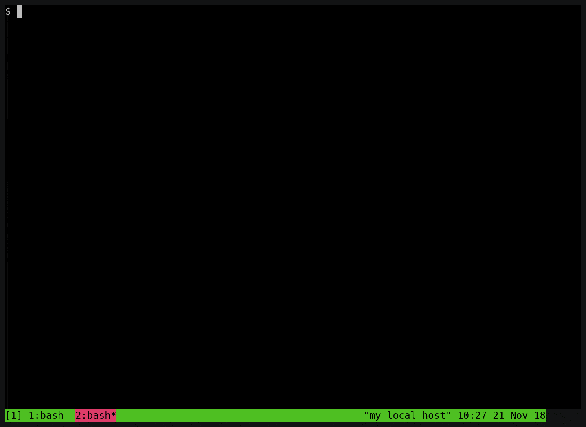

## What this is
Bash completion scripts to open synchronized split windows in `tmux` for lists of hostnames specified in `~/.tmuxmulti`: 
* `tm  LIST_NAME(S)` ("Connect in a split terminal to all hosts in the matched list(s)")
* `tmh HOSTNAME(S)`  ("Tmux Multi by Host", same but for matching against the hostnames rather than list names)

The system-of-record for both of these is a `~/.tmux_clusters` file (see below for format).  
`~/.ssh/known_hosts` is also read unless disabled (see Configuration below)


## Installation

*Note that ${HOMEBREW_PREFIX} is empty on linux, so the commands should be cross-platform:*

### Option 1 (static)
1. Copy one or both scripts to your ${HOMEBREW_PREFIX}/etc/bash_completion.d/ 

### Option 2 (dynamic, you can just `git pull` to update to latest)
1. Check out and symlink 
```shell
    # This should work in Linux and MacOS
    git clone https://github.com/akomakom/tmuxmulti.git
    ln -s $(pwd)/tmuxmulti/tmuxmulti ${HOMEBREW_PREFIX}/etc/bash_completion.d/
    ln -s $(pwd)/tmuxmulti/tmuxmultihost ${HOMEBREW_PREFIX}/etc/bash_completion.d/
```

### Configuration
1. Create a `~/.tmux_clusters` with lists of your hosts (see below)
2. Re-login or run `source ${HOMEBREW_PREFIX}/etc/bash_completion` in any shell you want to use this in.

Behavior can be customized by setting environment vars in `~/.bashrc`:
* `TMUXMULTI_DISABLE_KNOWN_HOSTS` - set to true to disable reading
  `~/.ssh/known_hosts` and adding those hostnames to the results

## Usage

Given this `~/.tmux_clusters` file:
```yaml
    ldap: ldap-001.my.secret.domain ldap-002.my.secret.domain
    nfs: nfs-00.my.secret.domain nfs-01.my.secret.domain
    docker-test: docker-test-01.my.secret.domain docker-test-02.my.secret.domain
    docker-swarm: docker-swarm-01.my.secret.domain docker-swarm-02.my.secret.domain docker-swarm-03.my.secret.domain
```

### Completion examples that will work using this file:
(All commands will only work from within tmux)
```shell
tm ldap           # connect to the two machines on the ldap: line
tm lda<TAB>       # completes to "tm ldap", same as previous
tm docker.*       # connects to 5 machines (in docker-test and docker-smarm)

tmh ldap<TAB>     # interactive completion to one of the ldap full hostnames
tmh ldap          # connects to both ldap machines (same as ldap-.* in this case)
tmh ldap-.*       # connects to both ldap machines 
tmh docker-swarm-0[1-2].*  # connects to 01 and 02 (not 03).
```


### Example
Note: `.mssh_clusters` was renamed to `.tmux_clusters` since making this gif:

